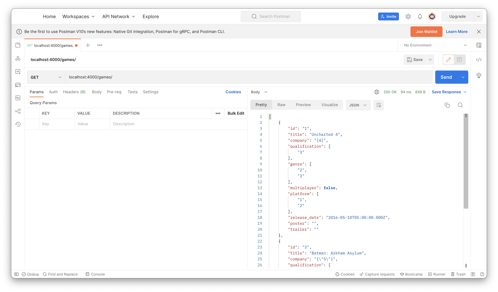
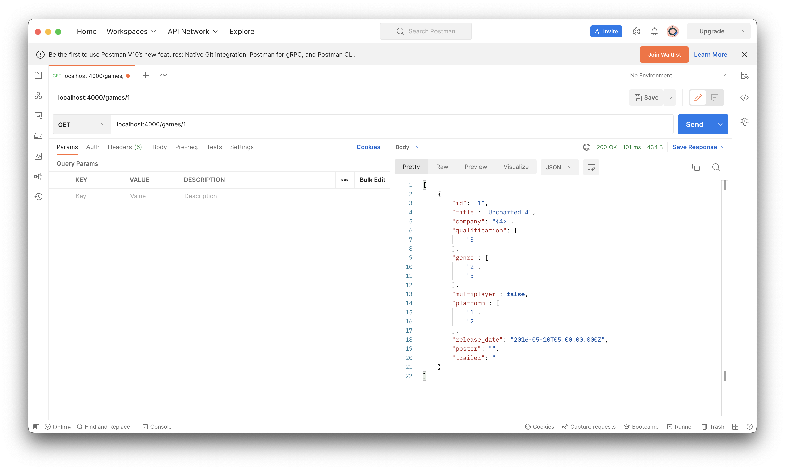
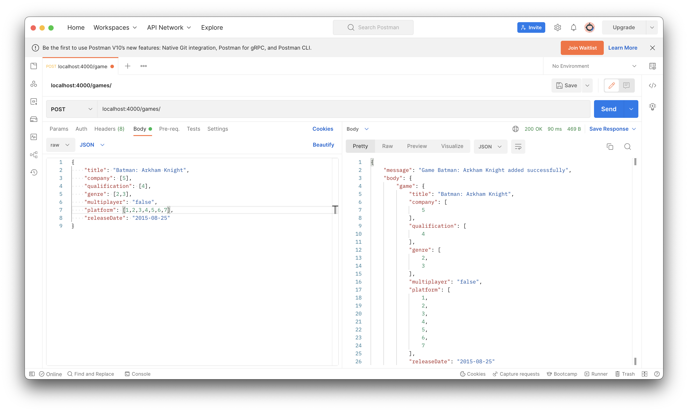
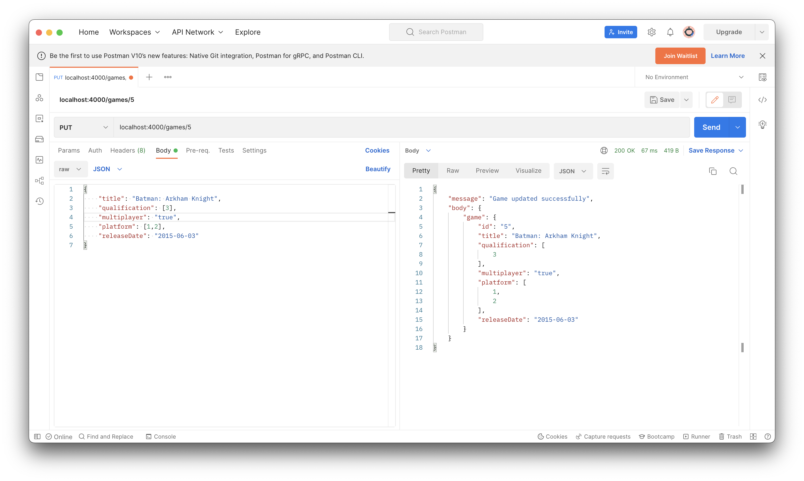
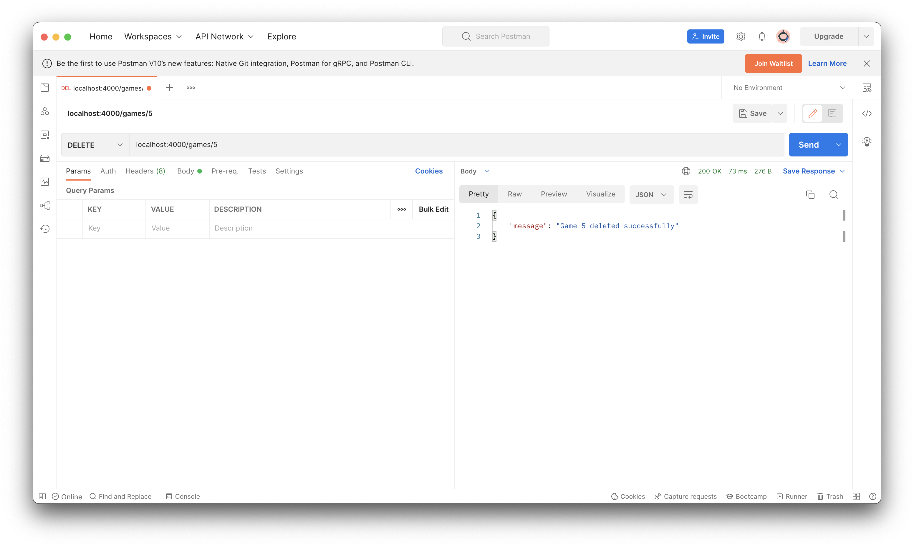

# Componente Practico 1

## Universidad Técnica de Manabí

## Desarrollo de Sistemas Informáticos

## Pablo Eduardo Palacios Álava

## 26 de agosto de 2022

---

## Actividad Práctica N°1

## Objetivo de la tarea

> Desarrollar un Backend mismo que permita conectarse a una base de datos , crear los métodos REST para un CRUD de una colección de datos.
>
> Probar las solicitudes de consumo REST mediante Insomnia REST, Postman o Rest client

## Instrucciones

> Crear el Backend, crear un servidor web, conectarse a una base de datos, crear un schema y modelo de los datos de la colección, crear los métodos que permita ingresar, actualizar, listar y eliminar información de la colección de la base de datos.
>
> Deberá incluir test unitarios en el código que verifique el funcionamiento de los métodos del backend a través del uso de Insomnia REST, Postman o Rest Client.
>
> Incluir un empaquetado que permita probar directamente y/o desplegar directamente la aplicación

---

## Descrición del proyecto

> El siguiente proyecto es un Backend creado con **_NodeJS_** con **_PostgreSQL_** como geestor de base de datos; para una tarea de la asignatura Desarrollo de Sistemas Informáticos.

### Idea del proyecto

El proyecto se basa en un **_CRUD_** para videojuegos para la creación, recuperación, actualización y eliminación

---

### Preparación de la base de datos

> La base de datos se realizó con **_PostgreSQL_**, para lo cual se agrega un archivo, en la raíz del proyecto, que se llama `database.sql`.
>
> El archivo `database.sql` contiene los comandos para la creación de la base, secuencias y tablas y ejemplos de inserción.

### Variables de entorno

> Para este proyecto se usaron variables de entorno para lo cual es necesario crear el archivo `.env` en la raíz del directorio del proyecto y agregar las siguietes variables de entorno con los datos propios para que funcione. Para este ejemplo usamos estos datos.

```
# Puerto de escucha para el backend
APPPORT=4000

# Datos de configuración para la conexión a al base de datos
PGUSER=pablopalacios
PGHOST=localhost
PGPASSWORD=admin
PGDATABASE=gamestore
PGPORT=5432
```

### Antes de iniciar este proyecto

> Instalar las dependencias necesarias

```
npm install
```

> Para levantar el proyecto, en modo desarrollo, es necesario el siguiente comando

```
npm start
```

> Para reflejar los cambios realizados en caliente mientras el back este corriendo podemos utilizar el siguiente comando

```
npm run dev
```

---

## Demostración del back en funcionameinto con la herramienta **_Postman_**

### Método de recuperación total - **_GET_**

`http://localhost:4000/games/`


### Método de recuperación por el **_id_** - **_GET_**

`http://localhost:4000/games/1`


### Método de creación - **_POST_**

`http://localhost:4000/games/`


### Método de actualización - **_PUT_**

`http://localhost:4000/games/5`


### Método de eliminación - **_DELETE_**

`http://localhost:4000/games/5`

